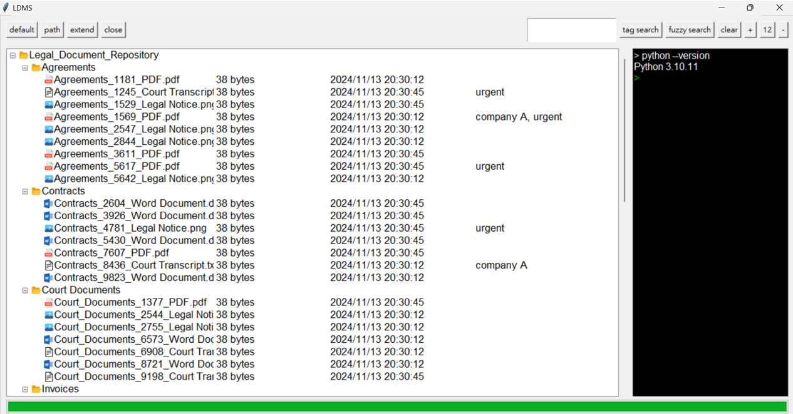
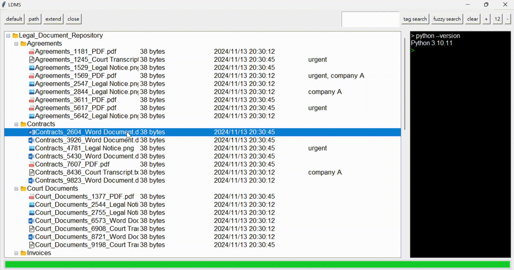
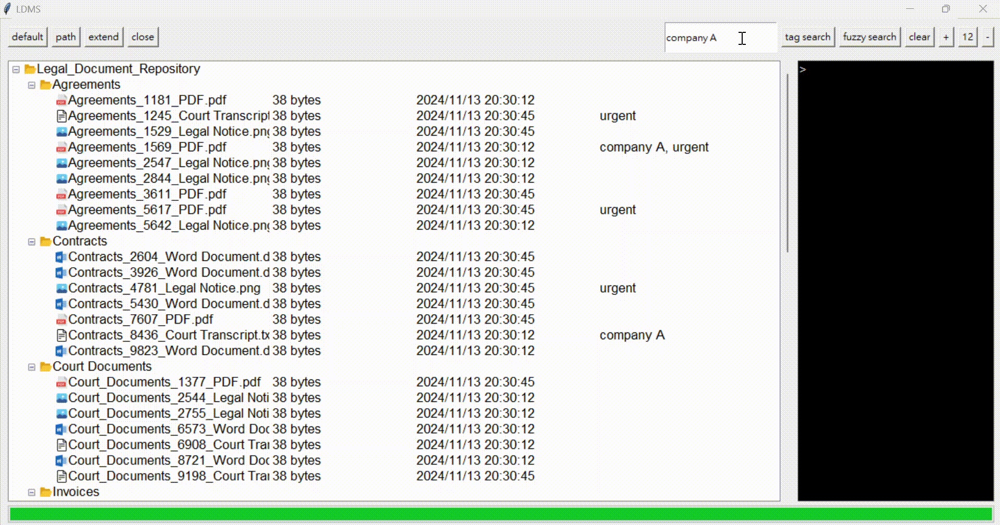

# DMS
A Document Management System (DMS) developed using Tkinter, featuring capabilities for tagging, label-based search, and fuzzy search to efficiently organize and retrieve documents.

## Introduction

### Tagging

### Tag Search & Fuzzy Search

#### Tag Search

#### Fuzzy Search
